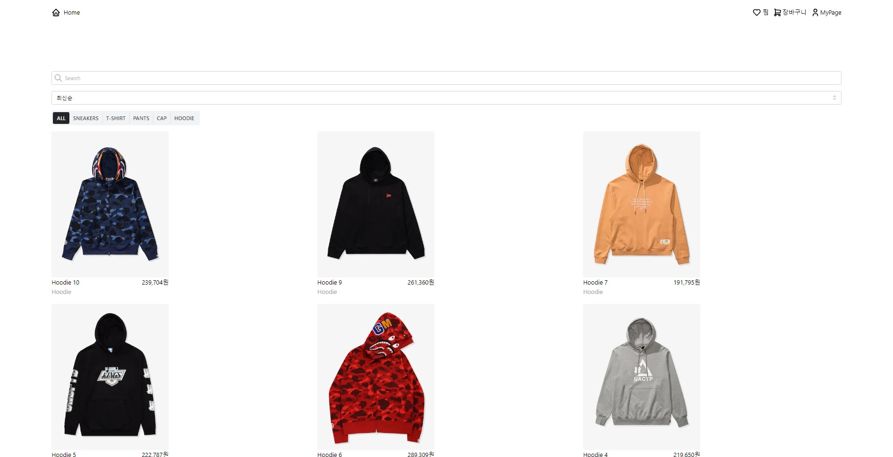
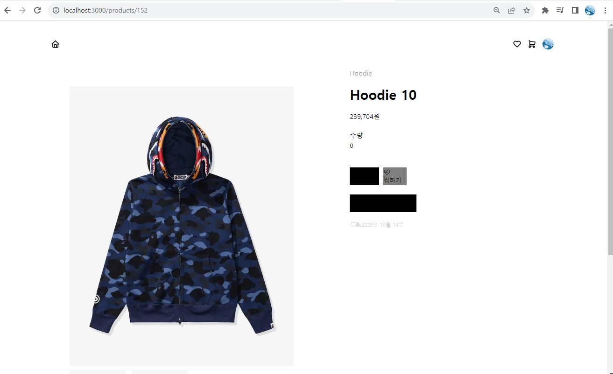

# [NEXT를 사용한 쇼핑몰 커머스]

**사이트 바로 가기 👉 [클릭!](https://next-commerce-seven-chi.vercel.app/)**

---

 

# 📖 Contents

- [🌈 Background](#-background)
- [🛠 Features](#-features)
- [📈 Release Note](#-release-note)
- [🪃 Skills](#-skills)
  - [Client](#client-1)
  - [Server](#server-1)
- [🧗 Challenges](#-challenges)
  - [1. React Quill을 선택, 그리고 그 안에서 도전](#1-react-quill을-선택-그리고-그-안에서-도전)
    - [1) 에디터에 HTML문법이 자동으로 적용되는 현상](#1-에디터에-html문법이-자동으로-적용되는-현상)
    - [2) GET 요청을 통해 데이터를 받아올 때 적용이 되지 않는 현상](#2-get-요청을-통해-데이터를-받아올-때-적용이-되지-않는-현상)
  - [2. React Quill을 걷어내다](#2-react-quill을-걷어내다)
  - [3. Redo, Undo가 작동하지 않다](#3-redo-undo가-작동하지-않다)
- [🙏 마무리하며..](#-마무리하며)

 

# 🌈 Background
프론트엔드개발에서 React의 사용도가 증가하는 추세이다. 하지만 React의 문제점인 CSR의 단점인 SEO와 로딩속도 등을 보완하기 위해 사용하는 Next의 이해와 단순한 정적인 웹사이트가 아닌 DB와 서버를 연결하여 동적인 웹사이트를 만들어보고 웹의 전체적인 동작을 이해하고 여러 CSS라이브러리, API를 이해하기 위해서 이 프로젝트를 시작하게 되었다.

 

# 🛠 Features
- Main Page
    - 여러 페이지로 이동할 수 있는 UI가 보이고 DB에 저장한 상품들이 보입니다.
   
- Header 
    - Home: Main Page로 이동합니다
    - LogOut: 로그인 시에만 보입니다. 로그아웃을 할 수 있습니다.
    - 찜: 유저가 찜한 상품을 볼 수 있는 페이지입니다.
    - 장바구니: 유저가 장바구니에 넣은 상품을 볼 수 있는 페이지입니다.
    - MyPage: 비로그인 시 구글 계정으로 로그인 할 수 있도록 이동하고 로그인 시에는 자신이 구매할 상품들을 확인할 수 있습니다.
 

# 📈 Release Note
| version | log |
| --- | --- |
| 9.3 | Planet Scale Prisma 이용하여 DB 추가 및 연결 |
| 9.4 | 상품 카테고리 분류 추가 |
| 9.5 | 상품 검색기능 추가 |
| 9.6 | 회원가입(Google OAuth) 기능 추가 |
| 9.7 | 회원가입(Google OAuth) 기능 추가 |
| 9.8 | 로그인 기능 추가(Google OAuth) |
| 9.9 | 찜하기 버튼 추가 및 찜한 상품 확인 페이지 추가 |
| 9.10 | 장바구니 UI 추가 |
| 9.11 | 장바구니 기능 추가 |
| 9.12 | 구매하기 기능 추가 |
| 9.13 | 구매한 상품 한에서 후기 남기기 기능 추가 |

 

# 🪃 Skills

## Client

- ES2015+
- Next
- Next Router
- React Query
- Google OAuth
- Tabler-Icon, Mantine
- TailWind CSS
- Emotion, styled-component 

## Server

- ES2015+
- Node.js
- Prisma DB

## Version Control

- Git, Github

## Deployment 

- Vercel

 

# 🧗 Challenges

한달 동안 기능 개발을 하면서 겪은 어려움 또는 도전은 아래와 같습니다.

 

## 1. React Query을 선택

초기 구현은 React의 useEffect를 사용했습니다. useEffect를 사용했을 때는 불필요한 상황에서도 모든 데이터를 가져오고 리렌더링 되는 문제점이 있었습니다. 그렇기 때문에 React-Query를 이용해서 코드를 간결하게 하고 데이터를 가져오고 상태를 업그레이드 하는 것을 자동으로 처리할 수 있었습니다. 또한 React-Query는 **데이터를 다시 요청하지 않고도 데이터를 빠르게 액세스 할 수 있게 해주기 때문에** 애플리케이션 성능을 향상 시키는데 도움이 됩니다. 그렇기 때문에 useEffect로 구현한 데이터 업데이트들을 리팩토링하여 더욱 더 성능을 최적화 할 수 있었습니다.
 

## 2. Google OAuth와 Next-Auth 활용

회원을 나누는 기준으로는 비회원, 준회원, 정회원, 휴면회원, 탈퇴회원 정도가 있다. 그 중에서도 크게는 비회원, 준회원, 정회원 정도로 나누고 기준에 따라 권한을 부여하는 것이 일방적이다. 그래서 간단한 로그인을 구현하고 로그인의 유무에 따라 기능을 사용할 수 있도록 하기 위해서 Google OAuth를 사용하였다. Google OAuth를 사용한 이유는 개발자들이 대중적으로 사용하는 계정인 Git hub 계정이 여러 개발관련 사이트에서 회원가입 과정없이 공통적으로 사용할 수 있는 것 처럼 많은 사람들이 모두 하나쯤은 가지고 있는 Google 계정으로 로그인 할 수 있는 편리함이 있기 때문이다.

Google OAuth를 통해서 받아온 사용자의 정보를 DB에 저장했지만 여기서 끝이 아니었다. 결국 해당 정보를 이용해서 로그인 처리를 해야하기 때문이다. 그래서 최종적으로 Next-Auth 라이브러리와 Session을 이용해서 Session의 userID가 DB의 정보와 일치하다면 로그인을 성공하도록 하였다.

 

## 2. Mantine Component UI 깨지는 문제 

개인 프로젝트인 만큼 여러 CSS 라이브러리를 사용하였다.(Styled-component, Emotion, Tailwind, Mantine, Tabler-Icon 등)
그 중에서도 Mantine UI를 사용했었다. 하지만 Next의 SSR(Server Side Rendering)의 특징 때문인지 아래의 이미지와 같이 첫 렌더링에서는 문제없지만 새로고침 후 재렌더링이 됐을 때 UI가 모두 깨지는 현상이 발생했다. 이 문제를 해결하기 위해 여러 방면으로 찾아봤지만 해결하지 못했다. 찾아본 결과로는 Mantine 라이브러리가 내부적으로 styled-component로 되어있는데 Next에서 styled-component가 적용이 안되는 경우가 있다고 했다. 그래서 코드나 설정을 바꿔봣지만 해결하지 못하였다.
그래서 사용하려고 하였던 UI를 내가 직접 CSS로 구현하였다. 해결하지 못한 부분이 아쉬웠지만 Mantine의 사용법과 직접 CSS를 적용함으로써 UI를 조금더 유저친화적으로 구성할 수 있는 계기가 되었다.

 

# 🙏 마무리하며..

이 프로젝트를 시작으로 새로운 마침표들을 하나둘씩 찍어가는 개발자가 되고 싶습니다 🙂   